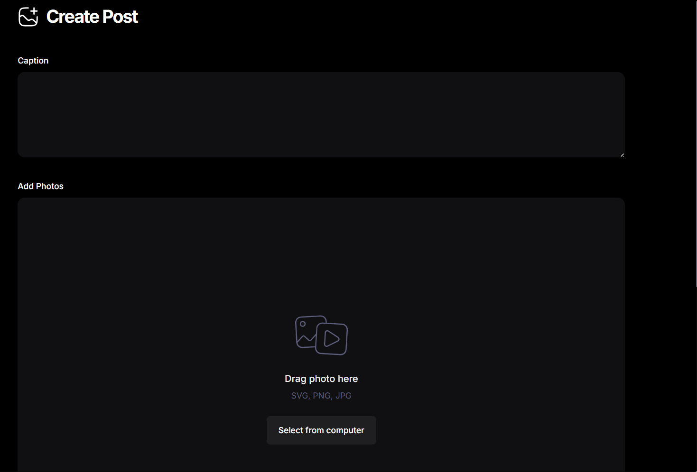
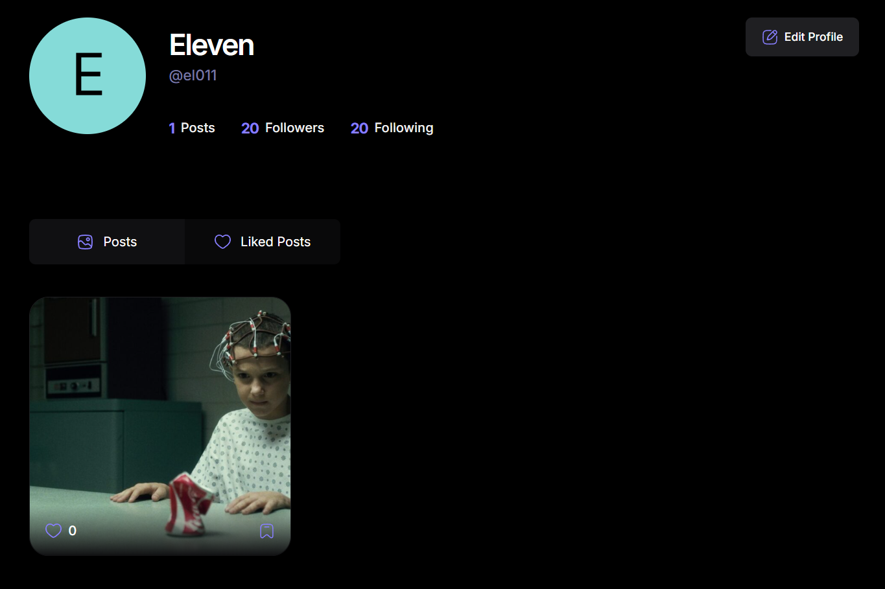

# 📱 PrimeFlick – A Modern Social Media Platform

Primeflick is a modern Instagram-style photo-sharing social app built using the Backend-as-a-Service (BaaS) model. By leveraging Appwrite, it eliminates the need for managing traditional backend infrastructure, offering a seamless developer experience with built-in authentication, file storage, database, and serverless functions.

From user authentication to post creation and feed interaction, Primeflick delivers a complete end-to-end solution using React, React Query, and Appwrite, resulting in a scalable, maintainable, and performant application.

---

## 🧭 Introduction

PrimeFlick offers a platform where users can:

- Create and share posts with the community.
- Explore content from other users.
- Engage through likes and comments.
- Manage their profiles and settings.

The application emphasizes user experience, responsiveness, and real-time interactions.

---

## <a name="tech-stack">⚙️ Tech Stack</a>

- React.js
- Appwrite
- React Query
- TypeScript
- Shadcn
- Tailwind CSS

---

## <a name="features">🔋 Features</a>

👉 **Authentication System**: A robust authentication system ensuring security and user privacy

👉 **Explore Page**: Homepage for users to explore posts, with a featured section for top creators

👉 **Like and Save Functionality**: Enable users to like and save posts, with dedicated pages for managing liked and saved content

👉 **Detailed Post Page**: A detailed post page displaying content and related posts for an immersive user experience

👉 **Profile Page**: A user profile page showcasing liked posts and providing options to edit the profile

👉 **Browse Other Users**: Allow users to browse and explore other users' profiles and posts

👉 **Create Post Page**: Implement a user-friendly create post page with effortless file management, storage, and drag-drop feature

👉 **Edit Post Functionality**: Provide users with the ability to edit the content of their posts at any time

👉 **Responsive UI with Bottom Bar**: A responsive UI with a bottom bar, enhancing the mobile app feel for seamless navigation

👉 **React Query Integration**: Incorporate the React Query (Tanstack Query) data fetching library for, Auto caching to enhance performance, Parallel queries for efficient data retrieval, First-class Mutations, etc

👉 **Backend as a Service (BaaS) - Appwrite**: Utilize Appwrite as a Backend as a Service solution for streamlined backend development, offering features like authentication, database, file storage, and more

and many more, including code architecture and reusability

---

## 🖼️ Application Preview

> _Here are a few screenshots from PrimeFlick in action, highlighting various screens like Explore, Create Post, Profile, and Post Detail views._

### 🧭 Explore Page

### 📌 Post Detail

### ✍️ Create Post

### 👤 User Profile

---

## ⚡ React Query Usage in PrimeFlick

PrimeFlickk uses **React Query (TanStack Query)** extensively to manage data fetching, caching, and mutations efficiently.

### 🔍 `useQuery`

Fetches frequently accessed data:

- Retrieves posts for Explore and Saved pages
- Loads user profiles and post details
- Caches data for instant access
- Refetches in the background for fresh content
-

✅ Automatically caches and refetches data in the background for a snappy experience.

---

### 📄 Pagination (`useInfiniteQuery`)

Implements efficient paginated data fetching:

- Used on the **Explore Page** to fetch posts in chunks (pages), improving load time and scalability
- Enables **infinite scrolling** by fetching the next page of posts only when needed
- Caches previous pages while allowing smooth data appending
- Automatically handles page params, loading states, and error boundaries
- Seamlessly integrates with the scroll event to provide a native app-like browsing experience

---

### ✍️ `useMutation`

Manages data modifications:

- Creating and editing posts
- Liking and saving posts
- Editing profile data

🔄 Automatically updates or invalidates related queries after mutation.

---

### ⌛ Debouncing (e.g., `useDebounce`)

Enhances performance and user experience during search operations:

- Applied in the **Browse Users** feature to delay API calls until the user stops typing
- Prevents excessive and unnecessary network requests for every keystroke
- Ensures smoother UI interactions and reduces backend load
- Used alongside `useQuery` to dynamically fetch users only when input stabilizes

---

## 🧠 Code Design Highlights

- 📦 **Modular Architecture** – Clean folder structure with separation of concerns
- 🔁 **Reusable Components** – Shared UI components and hooks
- 🛡️ **Type-Safe Codebase** – Written in TypeScript for better error handling and DX
- 🧪 **Scalable Patterns** – Supports easy feature expansion and refactoring

---
